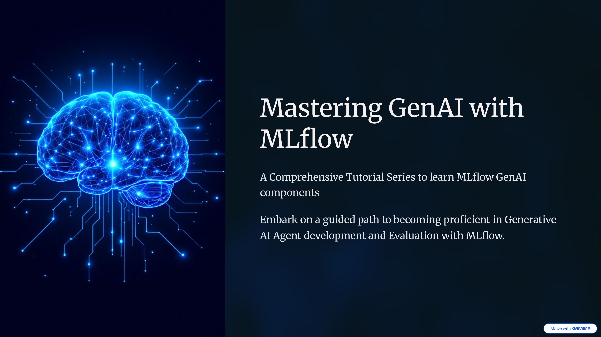

# MLflow GenAI Tutorial Series



[](https://www.python.org/)
[](https://mlflow.org/)
[](https://platform.openai.com/)
[](https://langchain.com/)
[](https://www.llamaindex.ai/)
[](https://docs.confident-ai.com/)
[](https://github.com/astral-sh/uv)
[](https://docs.ragas.io/)
[](https://dspy.ai/)
[](https://www.crewai.com/)
[](https://mlflow.org/docs/latest/genai/prompt-engineering/)
[](./README.md)

## Tutorial: Mastering GenAI with MLflow 

This tutorial series teaches you, in a step-by-step manner, how to use MLflow's open source platform for building, tracking, tracing, prompt registry and optimization, evaluating, and debugging GenAI applications.

### 📚 Tutorial Structure

| Notebook | Title | Description |
|----------|-------|-------------|
| 1.1 | [Setup and Introduction](01_setup_and_introduction.ipynb) | <ul><li>Understanding MLflow for GenAI</li><li>Installation and configuration</li><li>First tracked run</li><li>MLflow UI basics</li></ul> |
| 1.2 | [Experiment Tracking for LLMs](02_experiment_tracking.ipynb) | <ul><li>Tracking LLM parameters and metrics</li><li>Comparing model configurations</li><li>Cost tracking and optimization</li><li>Organizing experiments with tags</li><li>Parent-child runs for workflows</li></ul> |
| 1.3 | [Introduction to Tracing](03_introduction_to_tracing.ipynb) | <ul><li>Auto-tracing with MLflow</li><li>Understanding the trace model</li><li>Manual instrumentation</li><li>Viewing traces in UI</li></ul> |
| 1.4 | [Manual Tracing and Advanced Observability](04_manual_tracing_advanced.ipynb) | <ul><li>Custom span decorators</li><li>Tracing complex workflows</li><li>Debugging with traces</li><li>Multi-step agentic patterns</li></ul> |
| 1.5 | [Prompt Management](05_prompt_management.ipynb) | <ul><li>Creating prompt templates</li><li>Versioning prompts</li><li>Registering in the Prompt Registry</li><li>Searching Prompt Registry</li><li>Using prompts from the Prompt Registry</li><li>Linking prompts to experiments</li></ul> |
| 1.6 | [Framework Integrations](06_framework_integrations.ipynb) | <ul><li>OpenAI direct API integration</li><li>LangChain chains and workflows</li><li>LlamaIndex document indexing and RAG</li><li>Framework comparison matrix</li><li>Best practices for each framework</li></ul> |
| 1.7 | [Evaluating Agents](07_evaluating_agents.ipynb) | <ul><li>LLM-as-Judge evaluation patterns</li><li>MLflow built-in scorers (RelevanceToQuery, Correctness, Guidelines)</li><li>Custom scorers with @scorer decorator</li><li>DeepEval integration for conversations</li><li>Session-level multi-turn evaluation</li></ul> |
| 1.8 | [Prompt Optimization with GEPA](08_prompt_optimization.ipynb) | <ul><li>Automatic prompt optimization with GEPA algorithm</li><li>MLflow Prompt Registry integration</li><li>Before/after evaluation comparison</li></ul> |
| 1.9 | [Complete RAG Application](09_complete_rag_application.ipynb) | <ul><li>Building a full RAG pipeline</li><li>End-to-end tracing</li><li>Performance analysis</li><li>RAG evaluation with RAGAS metrics</li></ul> |
| 1.10 | [Multi-Agent Supervisor Pattern](10_multi_agent_supervisor.ipynb) | <ul><li>Supervisor agent that routes queries to specialized subagents</li><li>Genie agent for structured data queries (SQL over pandas DataFrame)</li><li>Knowledge Assistant for document retrieval and policy Q&A</li><li>Full supervisor-subagent trace hierarchy with MLflow</li><li>3-layer evaluation: routing accuracy, response quality, orchestration</li></ul> |
| 1.11 | [LangGraph Deep Agents](11_deep_agents_langgraph.ipynb) | <ul><li>Deep Agents with built-in planning (write_todos / read_todos)</li><li>File system context management (read, write, edit files)</li><li>Sub-agent delegation via task() tool</li><li>Evaluating Deep Agent outputs with mlflow.genai.evaluate()</li><li>Auto-tracing with mlflow.langchain.autolog()</li></ul> |
| 1.12 | [CrewAI Multi-Agent Orchestration](12_crewai_multi_agent.ipynb) | <ul><li>Role-based agents with CrewAI (role, goal, backstory)</li><li>Custom tools: query_disaster_database and search_fema_policies</li><li>Hierarchical crew with manager agent delegating to specialists</li><li>Evaluating crew outputs with mlflow.genai.evaluate()</li><li>Auto-tracing with mlflow.crewai.autolog()</li></ul> |

## 🎓 Learning Outcomes

After completing this tutorial, you will be able to:

### Core Skills
- ✅ Set up MLflow for GenAI development
- ✅ Track LLM experiments systematically
- ✅ Implement comprehensive tracing
- ✅ Debug GenAI applications effectively
- ✅ Manage prompts with version control
- ✅ Build RAG systems

### Advanced Capabilities
- ✅ Cost tracking and optimization
- ✅ Performance analysis and debugging
- ✅ Multi-framework integration
- ✅ Hierarchical trace creation
- ✅ Custom span instrumentation
- ✅ Agent workflow tracing


### 🚀 Getting Started

This project uses [UV](https://docs.astral.sh/uv/) for dependency management.

1. **Install UV** (if not already installed)
```bash
curl -LsSf https://astral.sh/uv/install.sh | sh
```

2. **Install Dependencies**
```bash
uv sync
```

3. **Configure API Keys**
Create a `.env` file in the tutorials directory:
```
OPENAI_API_KEY=your-api-key-here
MLFLOW_TRACKING_URI=http://localhost:5000
```

4. **Start Jupyter**
```bash
uv run jupyter notebook
```

5. **Start MLflow UI** (in a separate terminal)
```bash
uv run mlflow ui --port 5000
```

6. **Open Browser**
Navigate to http://localhost:5000

### 📋 Prerequisites

- Python 3.10+
- [UV](https://docs.astral.sh/uv/) package manager
- OpenAI API key (or Databricks Workspace)
- Basic understanding of Python and LLMs

### 🎯 Learning Objectives

By the end of all tutorials, you will:

- ✅ Understand MLflow's core GenAI components
- ✅ Track and trace LLM experiments systematically
- ✅ Implement comprehensive tracing for observability
- ✅ Debug GenAI applications using trace visualizations and MLflow Assistant
- ✅ Manage prompts with version control and Prompt Registery
- ✅ Evaluate an agent using MLflow predefined judges, custom and integrated judges from DeepEval and RAGAS
- ✅ Build end-to-end RAG applications
- ✅ Build and evaluate multi-agent orchestration systems

### 📂 Directory Structure

```
mlflow-genai-tutorial-1/
├── 01_setup_and_introduction.ipynb
├── 02_experiment_tracking.ipynb
├── 03_introduction_to_tracing.ipynb     
├── 04_manual_tracing_advanced.ipynb     
├── 05_prompt_management.ipynb           
├── 06_framework_integrations.ipynb      
├── 07_evaluating_agents.ipynb
├── 08_prompt_optimization.ipynb
├── 09_complete_rag_application.ipynb
├── 10_multi_agent_supervisor.ipynb
├── 11_deep_agents_langgraph.ipynb
├── 12_crewai_multi_agent.ipynb
├── .env                                 (create this yourself and use the template env_template)
└── README.md
```

### 🔗 Resources

- [MLflow Documentation](https://mlflow.org/docs/latest/)
- [MLflow GenAI Guide](https://mlflow.org/docs/latest/genai/)
- [MLflow GitHub](https://github.com/mlflow/mlflow)
- [MLflow Community](https://mlflow.org/community/)

### 💡 Tips

- Keep the MLflow UI open while working through notebooks
- Experiment with different parameter values
- Compare runs in the UI to understand trade-offs
- Tag runs for easy organization
- Track costs from the beginning

### ❓ Troubleshooting

**Issue**: MLflow UI won't start
```bash
# Try a different port
uv run mlflow ui --port 5001
```

**Issue**: API key not recognized
```python
# Restart Jupyter kernel after adding to .env
# Or set manually:
import os
os.environ["OPENAI_API_KEY"] = "your-key"
```

**Issue**: Module not found
```bash
# Sync dependencies with UV
uv sync

# Or install specific package
uv add mlflow openai python-dotenv
```

### 📝 License

This tutorial series is provided as educational content for learning MLflow's GenAI capabilities.

---

## 📝 Feedback & Contributions

- Found an issue? Open a GitHub issue
- Have suggestions? Submit a pull request
- Want to share? Tag us on social media
- Questions? Check the MLflow community

---

**Authors**: Jules (Databricks Developer Relations) + Claude Code
**Date**: Feburary 2026
**MLflow Version**: 3.9.0+
