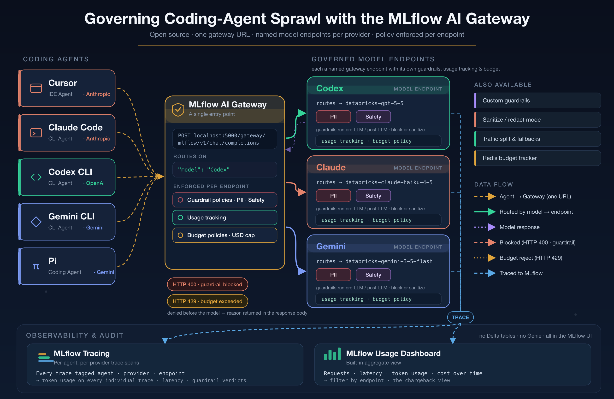

# Governing Coding-Agent Sprawl with the Open-Source MLflow AI Gateway



**The problem:** your developers use Cursor, Claude Code, Codex CLI, Gemini CLI, and Pi, spread across different model providers. Each agent calls an LLM with its own API key. Nobody knows who is spending what, nothing stops a prompt carrying customer data, and there is no audit trail.

**The solution:** route every agent through **one MLflow AI Gateway** to a named **model endpoint** per provider. Each endpoint carries its own guardrails and usage tracking; a budget policy caps spend. Every request goes through the gateway, and the gateway is where governance lives — no per-tool configuration, no scattered API keys.

The MLflow AI Gateway is **open source** and ships inside `mlflow server` (MLflow 3.x) — the gateway, guardrails, budget policies, and tracing all run locally. In this build the three endpoints route to **Databricks-hosted foundation models** through a Databricks LLM connection, but any provider connection (OpenAI, Anthropic, Google, …) works exactly the same way.

| Pillar | What it does |
|--------|--------------|
| Security & auditability | Per-endpoint guardrails (PII detection, Safety); every request logged as an MLflow trace |
| Cost management | Budget policies (USD thresholds, Alert or Reject), unified billing, one place to rotate keys |
| Observability | Traces with token usage per request, per-provider metrics, and the built-in Usage Dashboard |

> **Reference:** this demo is the open-source counterpart of the Databricks "Governing Coding Agent Sprawl with Unity AI Gateway" demo.

## What the demo covers

Five sequential acts:

| Act | What it shows |
|-----|---------------|
| 1. Verify the gateway | Pings each endpoint (`dbx-codex-endpoint`, `dbx-claude-endpoint`, `dbx-gemini-endpoint`) and prints what is reachable and configured. Fails fast if an endpoint is missing. |
| 2. Simulate the agent swarm | Five agents, each with its own persona prompt, each routed to its provider's endpoint. Clean coding requests, issued round-robin so the provider rotates on every call. |
| 3. Guardrails in action | PII, jailbreak, and unsafe-content requests denied by the endpoint's guardrails (HTTP 400 + the judge's rationale). Unsafe content also shows defense in depth: what the gateway allows through, the model still refuses. |
| 4. Budget policies | The open-source cost control. With a low budget policy set to **Reject**, a burst of requests spends past the cap and later requests get **HTTP 429**. |
| 5. MLflow tracing | Every request — allowed or denied — is captured as a trace, tagged with agent / provider / endpoint, with **token usage on each individual trace**. Browse them in the MLflow UI or verify with `mlflow.search_traces`. |

Agent-to-endpoint routing: **Cursor** and **Claude Code** use `dbx-claude-endpoint`; **Codex CLI** uses `dbx-codex-endpoint`; **Gemini CLI** and **Pi** use `dbx-gemini-endpoint`.

Every trace is tagged with `agent`, `provider`, and `endpoint`, which is what makes per-agent and per-provider attribution possible.

## Prerequisites

- MLflow **3.x** (`mlflow[genai]`) — this tutorial series pins **3.15.1**.
- A **Databricks connection** for the model backend: `DATABRICKS_HOST` and `DATABRICKS_TOKEN`
  (both already in the repo's root `.env`). The three endpoints route to Databricks-hosted
  foundation models. To use OpenAI/Anthropic/Google directly instead, create those connections
  and point the endpoints at them.
- The MLflow server is running locally with the three gateway endpoints configured (below).

## Configure the gateway in the MLflow UI

The notebook only *consumes* endpoints; it never creates or changes one. The open-source gateway is configured through the MLflow UI. Do this once before running the notebook.

1. **Start the server** from the repo root:

   ```bash
   uv run mlflow server --port 5000
   ```

   The gateway is served under the same process. Open `http://localhost:5000`.

2. **Add an AI Gatewway Endpoint** at `http://localhost:5000/#/settings` → **LLM Connections**. Create a **Databricks** connection (workspace host + token, from `DATABRICKS_HOST` / `DATABRICKS_TOKEN`) — it serves all three model endpoints below. Credentials are stored server-side and reused by endpoints. (To route to OpenAI/Anthropic/Google directly, create those connections here instead.)

   Create an MLflow Unity Endpoint as shown in the [documentation](https://mlflow.org/docs/latest/genai/governance/ai-gateway/quickstart/)

3. **Create the three endpoints** at `http://localhost:5000/#/gateway` → **Create Endpoint**:

   | Endpoint name | Provider | Model | Agents |
   |---------------|----------|-------|--------|
   | `dbx-codex-endpoint` | Databricks | `databricks-gpt-5-5` | Codex CLI |
   | `dbx-claude-endpoint` | Databricks | `databricks-claude-haiku-4-5` | Cursor, Claude Code |
   | `dbx-gemini-endpoint` | Databricks | `databricks-gemini-3-5-flash` | Gemini CLI, Pi |

   The endpoint **name** is what the notebook sends as the request's `model` field. If you use different names, update `ENDPOINTS` in the notebook's setup cell.

   

4. **Turn on guardrails** for each endpoint. Add a **PII detection** guardrail (Pre-LLM, action **Block**) and a **Safety** guardrail (Post-LLM, action **Block**). Guardrails run an LLM judge, so point them at one of your endpoints as the judge model. Act 3 exercises both.

   

5. **Enable usage tracking** on each endpoint so requests are logged and token/cost metrics populate the Usage Dashboard.

6. **Create a budget policy** (for Act 4 only) at **AI Gateway → Budgets → Create budget policy**: a small USD amount (e.g. **$0.05**), a **Daily** reset, and action **Reject**. To see the rejection promptly, lower the refresh interval when you start the server:

   ```bash
   MLFLOW_GATEWAY_BUDGET_REFRESH_INTERVAL=30 uv run mlflow server --port 5000
   ```

   

   > **Enable the tight budget only for Act 4.** A $0.05 cap will also reject Acts 2–3. Run Acts 1–3 and 5 with the budget disabled (or set high), then enable the low Reject budget just before Act 4.

## How agents reach the gateway

The API is OpenAI-compatible, so pointing any agent at the gateway is a `base_url` change and the endpoint name as the model:

```python
from openai import OpenAI

client = OpenAI(
    base_url="http://localhost:5000/gateway/mlflow/v1",
    api_key="not-needed",   # the gateway holds the real provider key
)
client.chat.completions.create(
    model="dbx-codex-endpoint",    # the gateway endpoint name
    messages=[{"role": "user", "content": "What is MLflow?"}],
    max_tokens=1024,
)
```

Or with plain HTTP:

```bash
curl -X POST http://localhost:5000/gateway/dbx-codex-endpoint/mlflow/invocations \
  -H "Content-Type: application/json" \
  -d '{"messages": [{"role": "user", "content": "What is MLflow?"}]}'
```

## Reading a guardrail block

A blocked request returns **HTTP 400**. With the OpenAI SDK that surfaces as `openai.BadRequestError`, and the judge's rationale is in the error body:

```python
try:
    client.chat.completions.create(model="dbx-codex-endpoint", messages=messages)
except openai.BadRequestError as e:
    print(e.body)   # {"detail": "... blocked by PII guardrail: contains an SSN ..."}
```

`detect`-style logic lives in `gateway_agents.py` (`send_request` catches the 400 and returns `blocked=True` with the reason). A **budget** rejection instead returns **HTTP 429** (`openai.RateLimitError`).

> A trap worth knowing: because a Safety/PII guardrail can run **Post-LLM**, a harmless prompt can be blocked for what the *model wrote back* — e.g. a request for a `pyproject.toml` gets blocked when the model fills in an author email. Ask for artifacts without those fields, or run PII Pre-LLM only.

## Running

```bash
# 1. Start the server and configure the gateway in the UI (see above).
uv run mlflow server --port 5000

# 2. From the repo root, launch the notebook.
uv run jupyter notebook ai_gateway_governance/mlflow_ai_gateway_governance.ipynb
```

Run Acts 1–3 and 5 with no (or a high) budget. Enable the low Reject budget just before Act 4.

## File structure

```
ai_gateway_governance/
├── mlflow_ai_gateway_governance.ipynb   # the demo notebook (acts 1–5)
├── gateway_agents.py                    # SimulatedAgent, gateway client, send_request, printers
├── scenarios.py                         # PII / injection / unsafe / clean scenarios + budget burst
├── prompts.py                           # system prompt per agent persona
├── images/                              # architecture diagram + UI screenshots
└── README.md
```

> `images/ai_gateway_architecture.png` (with its editable `.svg` source) ships with the demo.
> The UI-step screenshots referenced above (`llm_connection.png`, `create_endpoint.png`,
> `guardrails.png`, `budget_policy.png`) are placeholders — drop in real captures from your own
> MLflow UI.
